# Ipython 

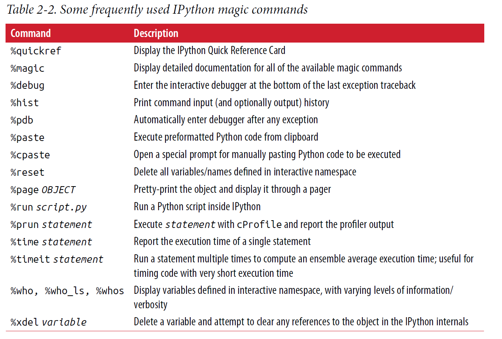

%run
%run -i

# Numpy as np
## ndarrays

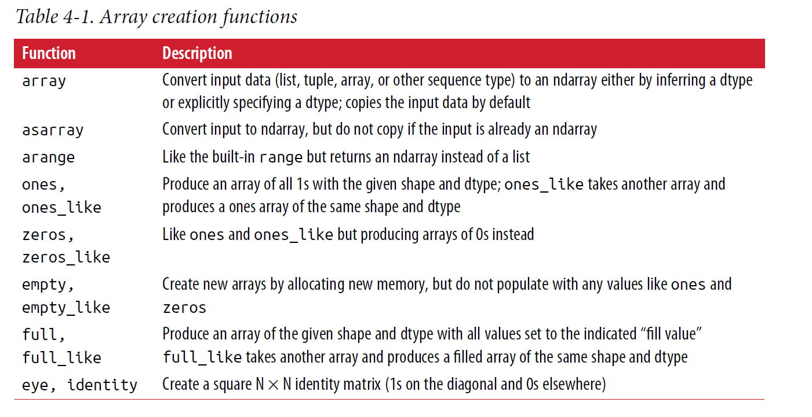

~~~~~
  Data=[1,2,3]                                              
  np.array(Data)
  array([ 1, 2, 3]
  
  np.zeros(10)
  array([ 0., 0., 0., 0., 0., 0., 0., 0., 0., 0.])
  
  np.empty(10)
  array([arbitrary*10])
  
  np.ones(10)
  array([ 1., 1., 1., 1., 1., 1., 1., 1., 1., 1.])
  
  np.arange(15)                                                           
  array([ 0, 1, 2, 3, 4, 5, 6, 7, 8, 9, 10, 11, 12, 13, 14])
  
  np.full(10,5)
  array([ 5*10])
  
  #一些常见矩阵创建方法
  
  arr = np.arange(32).reshape((8, 4))                         
  
  arr = np.empty((8, 4))
  for i in range(8):
      arr[i] = i
  
  arr=np.ones(10,dtype='?')    #bool
  np.full((10,5),True) 
  
  D.dtype
  D.ndim
  D.shape
  
  
~~~~~~~
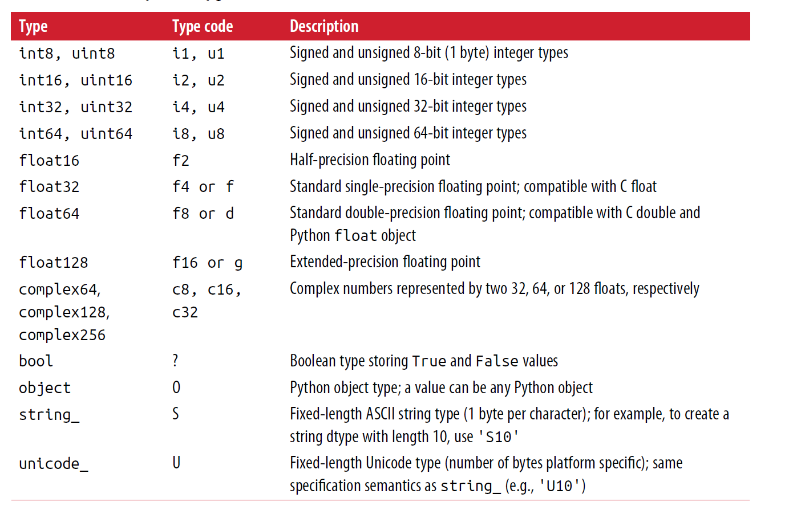

## np.astype()

    - Calling astype always creates a new array (a copy of the data), even
      if the new dtype is the same as the old dtype.
~~~~~~~~

  arr=np.ones(10,dtype='?')
  a=arr.astype('i4')
  a=arr.astype(np.int32)
  
  
  numeric_strings = np.array(['1.25', '-9.6', '42'], dtype=np.string_)
  numeric_strings.astype(float)
  array([ 1.25, -9.6 , 42. ])
  
  boo_array=npp.array([True,False])
  int_array.astype(bool_array.dtype)
  
  

~~~~~~~~

## dtype hierarchy

~~~~~
np.issubdtype(sub,parent_type)

np.float64.mro()
~~~~~

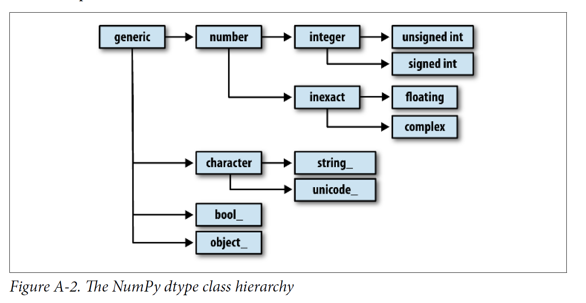

## strids
  每个dim上该arry存储的byte
  以此来访问每一个数据
~~~~~~~

  In [11]: np.ones((3, 4, 5), dtype=np.float64).strides
  Out[11]: (160, 40, 8)

  5*8 40 *4 160
  
~~~~~~~

## Arithmetic

~~~~~~
  
  arr * 10
  arr ** 0.5
  -------------------
  math.sin(1)
  0.8414....
  np.sin(1)
  0.8414....
  
  math.sin(arr)
  Error  
  np.sin(arr)
  [.841,.841]
  --------------------
 
  arr > arr2 
  array([[False, True, False],
        [ True, False, True]], dtype=bool)
  
~~~~~~

## slice [a:b]

~~~~~~~
 !!!index in slice a,b  it's index, from 0 
 a 包含
 b：不包含
 
 arr [0:1] =arr[0]
 arr [3:6] =(3,4,5) arr[3].append(arr[4]).append(arr[5])
 
  "one end" & "bare" slice: 
 [a:],[:b],[:]
 arr_slice[a:]  a to end  
 arr_slice[:b]  begin to b-1  
 arr_slice[:]  all  
 
 [::-1] reverse
 
 arr = np.ones(10)
 arr[5:8] = 12 普通的array 不可以
 : array([1,1,1,1,1,12,12,12,1,1])
 
 arr_slice = arr[5:8]
 arr_slice
 : array([12, 12, 12])
 
 !!! note the slice edition will change the original array
 all above typeof slice include[::-1]
 
 arr_slice[1]=12345
 arr
 array([ 1... ,12, 12345, 12,1,1])
 
 using arr[5:8].copy()  !!!
 ~~~~~~~
 
 
 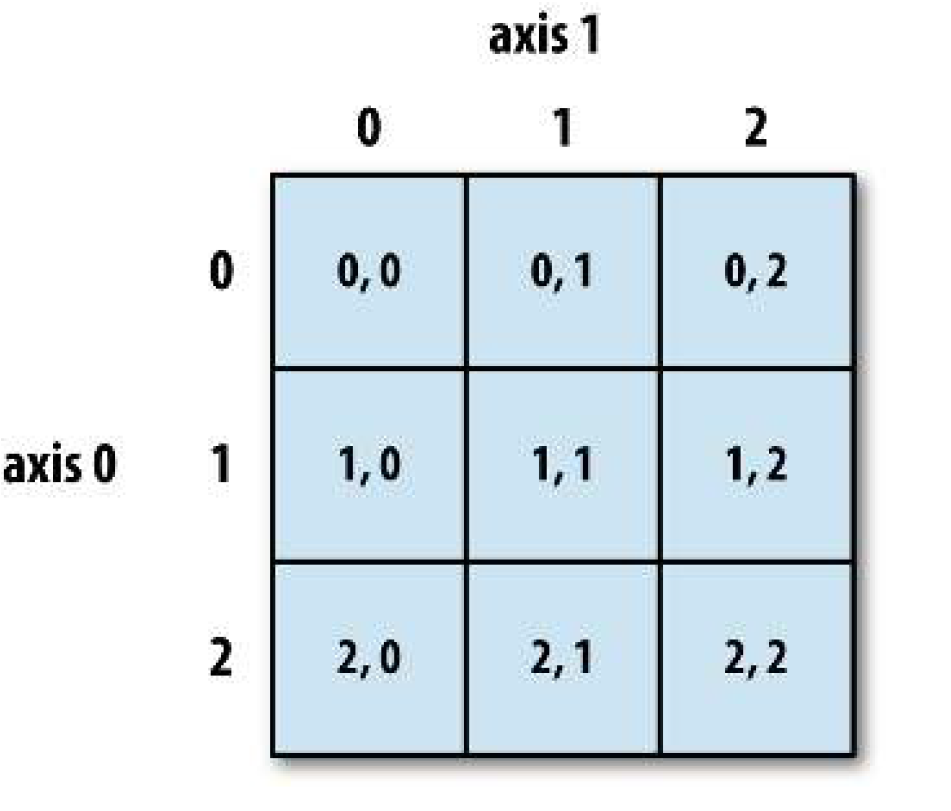
 
 ~~~~~~~
 
 hight dimension 
 
 arr_hightd[a][b][c]
 arr_hightd[a,b,c]
 
 notice !!
 arr3d.shape=(2,2,3)
 arr3d[0]= 42 will change all the [0]th 2*3 2d-array's value to 42
 
 

~~~~~~~
  __all this kind of selections are views__
  __whcih means if you change it you will change the original as well__

~~~~~~~

arr2d
  array([[1, 2, 3],
         [4, 5, 6],
         [7, 8, 9]])
       
arr2d[:2]
  array([[1, 2, 3],
         [4, 5, 6]])

multiple slices:

arr2d[:2, 1:]
  array([[2, 3],
         [5, 6]])
         
arr2d[1, :2]
  array([4, 5])
  
arr2d[:2, 2]      #noice this is a little different ,it will take the 'column' to a single array
  array([3, 6])   # see below  if you use [:2,2:] will give you 'column'

arr2d[:, :1]     #if you want the 'column' version use slice 
  array([[1],
         [4],
         [7]])
  
~~~~~~~
__Note that a colon by itself means to take the entire__
__axis, so you can slice only higher dimensional axes by colon [:]__

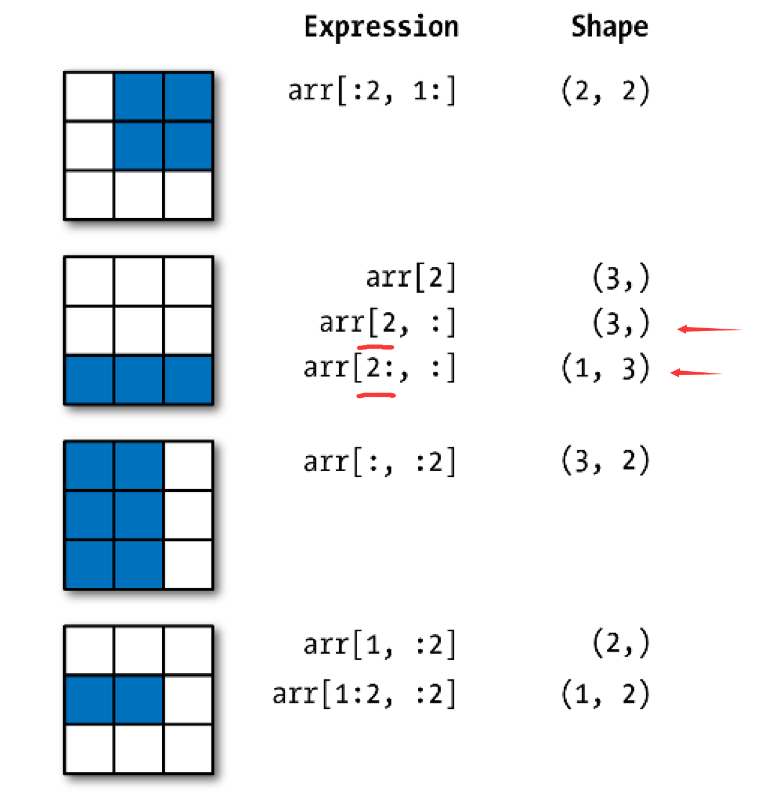

## Boolean Indexing

- Suppose each name corresponds to a row in the data array and we wanted to select
all the rows with corresponding name 'Bob'.

__Boolean selection will not fail if the boolean array is not the correct
length, so I recommend care when using this feature__
~~~~~~
names = np.array(['Bob', 'Joe', 'Will', 'Bob', 'Will', 'Joe', 'Joe'])
data = np.random.randn(7, 4)

names == 'Bob'
Out: array([ True, False, False, True, False, False, False], dtype=bool)

data[names == 'Bob']
Out:
array([[ 0.0929, 0.2817, 0.769 , 1.2464],
       [ 1.669 , -0.4386, -0.5397, 0.477 ]])
~~~~~~

__You can even mix and match boolean arrays with slices or integers (or sequences of integers__

~~~~~~~
In [104]: data[names == 'Bob', 2:]
Out[104]:
array([[ 0.769 , 1.2464],
       [-0.5397, 0.477 ]])

In [105]: data[names == 'Bob', 3]
Out[105]: array([ 1.2464, 0.477 ])

~~~~~~~

__To select everything but 'Bob', you can either use != or negate the condition using ~:__

__combine multiple boolean conditions,use
boolean arithmetic operators like & (and) and | (or):__

**python ___'and' 'or'___ not work**

~~~~~~~
names != 'Bob'

data[~(names == 'Bob')]

mask = (names == 'Bob') | (names == 'Will')

data[mask]

~~~~~~~

__Selecting data from an array by boolean indexing always creates a copy of the data,
even if the returned array is unchanged.__

__Setting values with boolean arrays works in a common-sense way__

__this is setting value so not about copy:)__ 

~~~~~~~

In [113]: data[data < 0] = 0
In [114]: data
Out[114]:
array
([[ 0.0929, 0.2817, 0.769 , 1.2464],
  [ 1.0072, 0. , 0.275 , 0.2289],
  [ 1.3529, 0.8864, 0. , 0. ],
  [ 1.669 , 0. , 0. , 0.477 ],
  [ 3.2489, 0. , 0. , 0.1241],
  [ 0.3026, 0.5238, 0.0009, 1.3438],
  [ 0. , 0. , 0. , 0. ]])

In [115]: data[names != 'Joe'] = 7
In [116]: data
Out[116]:
array
([[ 7. , 7. , 7. , 7. ],
  [ 1.0072, 0. , 0.275 , 0.2289],
  [ 7. , 7. , 7. , 7. ],
  [ 7. , 7. , 7. , 7. ],
  [ 7. , 7. , 7. , 7. ],
  [ 0.3026, 0.5238, 0.0009, 1.3438],
  [ 0. , 0. , 0. , 0. ]])

~~~~~~~

## Fancy Indexing

~~~~~~~~~

array([[ 0., 0., 0., 0.],
       [ 1., 1., 1., 1.],
       [ 2., 2., 2., 2.],
       [ 3., 3., 3., 3.],
       [ 4., 4., 4., 4.],
       [ 5., 5., 5., 5.],
       [ 6., 6., 6., 6.],
       [ 7., 7., 7., 7.]])
       
       
In [120]: arr[[4, 3, 0, 6]]
Out[120]:
array([[ 4., 4., 4., 4.],
       [ 3., 3., 3., 3.],
       [ 0., 0., 0., 0.],
       [ 6., 6., 6., 6.]])      
       
       
In [121]: arr[[-3, -5, -7]]
Out[121]:
array([[ 5., 5., 5., 5.],
       [ 3., 3., 3., 3.],
       [ 1., 1., 1., 1.]])

~~~~~~~~~

__The behavior of fancy indexing in this case is a bit different from what some users
might have expected (myself included), which is the rectangular region formed by
selecting a subset of the matrix’s rows and columns. Here is one way to get that:__

~~~~

array([[ 0, 1, 2, 3],
[ 4, 5, 6, 7],
[ 8, 9, 10, 11],
[12, 13, 14, 15],
[16, 17, 18, 19],
[20, 21, 22, 23],
[24, 25, 26, 27],
[28, 29, 30, 31]])

In [124]: arr[[1, 5, 7, 2], [0, 3, 1, 2]]               #(1,0)(5,3)(7,1)(2,2)
Out[124]: array([ 4, 23, 29, 10])

In [125]: arr[[1, 5, 7, 2]][:, [0, 3, 1, 2]]
Out[125]:
array([[ 4, 7, 5, 6],
       [20, 23, 21, 22],
       [28, 31, 29, 30],
       [ 8, 11, 9, 10]])

~~~~

__Keep in mind that fancy indexing, unlike slicing, always copies the data into a new
array.__

## take put

~~~~~~

arr = np.arange(10) * 100
inds = [7, 1, 2, 6]
arr[inds]
array([700, 100, 200, 600])

arr.take(inds)
array([700, 100, 200, 600])

arr.put(inds, 42)
arr
array([ 0, 42, 42, 300, 400, 500, 42, 42, 800, 900])

arr.put(inds, [40, 41, 42, 43])
arr
array([ 0, 41, 42, 300, 400, 500, 43, 40, 800, 900])

inds = [2, 0, 2, 1]
arr = np.random.randn(2, 4)
arr

array([[-0.5397, 0.477 , 3.2489, -1.0212],
       [-0.5771, 0.1241, 0.3026, 0.5238]])
arr.take(inds, axis=1)

array([[ 3.2489, -0.5397, 3.2489, 0.477 ],
       [ 0.3026, -0.5771, 0.3026, 0.1241]])

~~~~~~

## Transposing Arrays and Swapping Axes

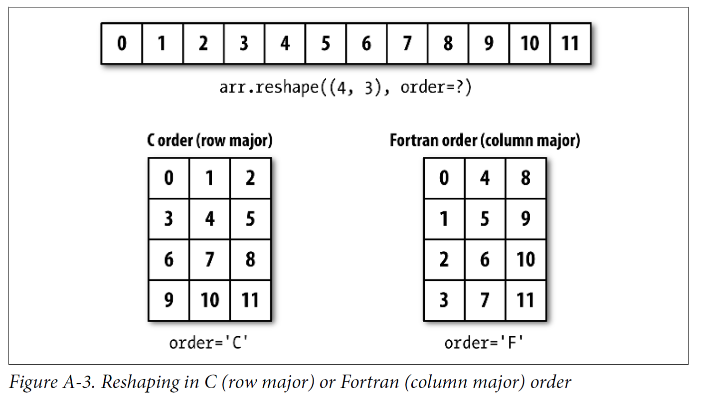

~~~~~~~

arr = np.arange(15).reshape((3, 5))      #reshape not copy 

arr
array([[ 0, 1, 2, 3, 4],
      [ 5, 6, 7, 8, 9],
      [10, 11, 12, 13, 14]])

arr.T
array([[ 0, 5, 10],
      [ 1, 6, 11],
      [ 2, 7, 12],
      [ 3, 8, 13],
      [ 4, 9, 14]])

In [22]: arr = np.arange(15)  
In [23]: arr.reshape((5, -1))       # -1 自动给那一个维度算出数量 前提是要能整除不然报错

Out[23]:
array([[ 0, 1, 2],
       [ 3, 4, 5],
       [ 6, 7, 8],
       [ 9, 10, 11],
       [12, 13, 14]])

拆开

arr.ravel()                             # not copy
array([ 0, 1, 2, 3, 4, 5, 6, 7, 8, 9, 10, 11, 12, 13, 14])

arr.flatten()                           # copy
array([ 0, 1, 2, 3, 4, 5, 6, 7, 8, 9, 10, 11, 12, 13, 14])

arr=np.arange(9).reshape(3,3)
np.ravel(arr,order="F")             # order "C" \ "F"
array([0,3,6,1,4,7,2,5,8])
~~~~~~~

- C/row major order
 - Traverse higher dimensions irst (e.g., axis 1 before advancing on axis 0).
- Fortran/column major order
 - Traverse higher dimensions last (e.g., axis 0 before advancing on axis 1).

- Transpose
~~~~~~~

In [132]: arr = np.arange(16).reshape((2, 2, 4))

In [133]: arr
Out[133]:                                          
array([[[ 0, 1, 2, 3],
        [ 4, 5, 6, 7]],
        [[ 8, 9, 10, 11],
        [12, 13, 14, 15]]])

In [134]: arr.transpose((1, 0, 2))               #这里的参数是axis 的 index    0轴 的shape为 2
Out[134]:                                        #                            1轴 的shape也为2
array([[[ 0, 1, 2, 3],                           #                            2轴  的shape为4
        [ 8, 9, 10, 11]],                        #   可以理解为 0,1,2 就是正常顺序的切法  比如 平着切 竖着切 横着切
        [[ 4, 5, 6, 7],                          #   然后他的transpose就是按照index的顺序来切
        [12, 13, 14, 15]]])

arr.transpose((2,1,0))
array([[[ 0,   8],
        [ 4,  12]],
        
        [[ 1,  9],
         [ 5, 13]],
        
        [[ 2, 10],
         [6,  14]],

        [[ 3, 11],
         [7,  15]]])

----------------------------

In [135]: arr
Out[135]:
array([[[ 0, 1, 2, 3],
        [ 4, 5, 6, 7]],
        [[ 8, 9, 10, 11],
        [12, 13, 14, 15]]])

In [136]: arr.swapaxes(1, 2)     #交换指定轴顺序
Out[136]:
array([[[ 0, 4],
        [ 1, 5],
        [ 2, 6],
        [ 3, 7]],
        [[ 8, 12],
        [ 9, 13],
        [10, 14],
        [11, 15]]])

~~~~~~~
__all above similarly returns a view on the data without making a copy__

## Universal Functions: Fast Element-Wise Array Functions

- Fast , element-wise

~~~~~~
unary ufuncs:          # unique 函数操作的对象是一个
      np.sqrt()    x**0.5

      np.exp()     e**x
      
binary ufuncs:         # binary!! 函数操作的对象是两个
      np.maximum(x, y)
      np.add(x,y,z)    # notice here will take the answer to the >> z not add 3 array
      
remainder, whole_part = np.modf(arr)  #返回整数部分和小数部分(fractional and integral part)
                                      # remainder小数  whole_part 整数 老外思维真神奇
                                      

arr
array([-3.2623, -6.0915, -6.663 , 5.3731, 3.6182, 3.45 , 5.0077])

np.sqrt(arr)
array([ nan, nan, nan, 2.318 , 1.9022, 1.8574, 2.2378])

np.sqrt(arr, arr)      #同上面z 第二个是输出到 >> arr
~~~~~~

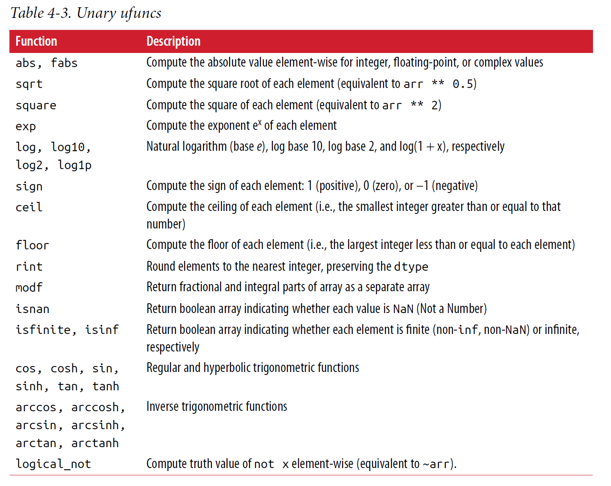

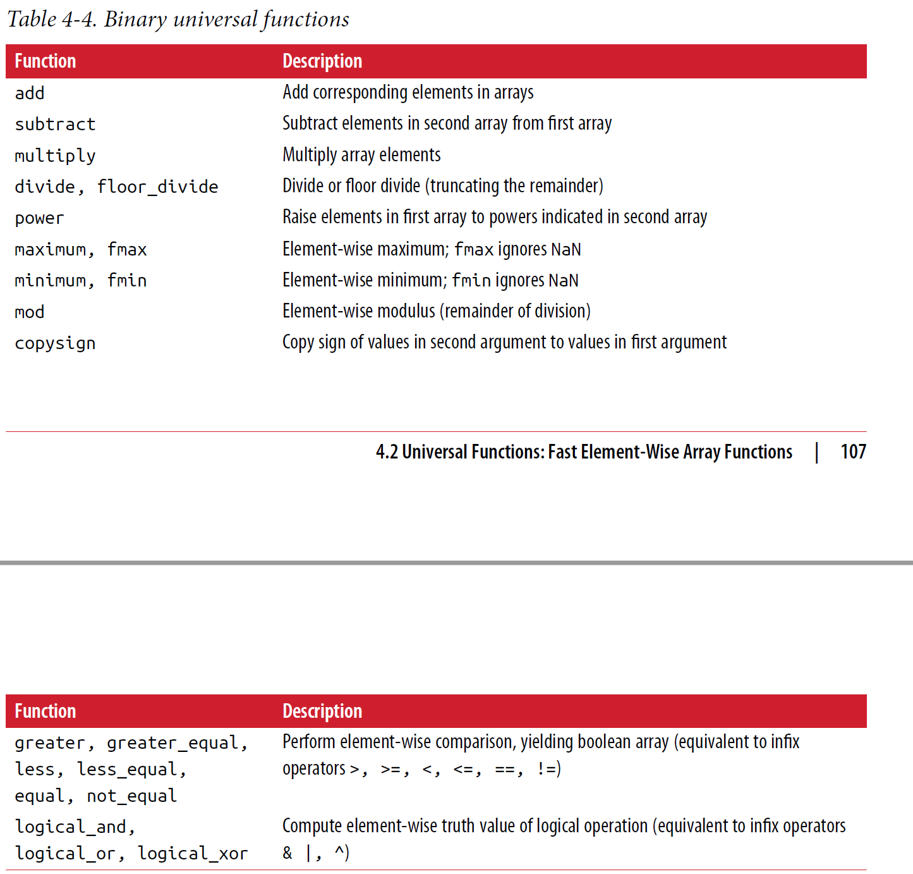

## Array-Oriented Programming with Arrays

 - np.meshgrid(\*xi,*\*kwargs)  # Return coordinate matrices from coordinate vectors
~~~~~~

x= [1,2,3,4,5]
c= [10,10,10,10]
x1,x2=np.meshgrid(x,c)

x1=[[1,2,3,4,5]]
    [[1,2,3,4,5]]
    [[1,2,3,4,5]]
    [[1,2,3,4,5]]
    
x2 =[[10,10,10,10]]
    [[10,10,10,10]]
    [[10,10,10,10]]
    [[10,10,10,10]]

points = np.arange(-5, 5, 0.01) # 1000 equally spaced points

xs, ys = np.meshgrid(points, points)

~~~~~~

## Expressing Conditional Logic as Array Operations
 - np.where(condition,[x,y])
~~~~~~
In [165]: xarr = np.array([1.1, 1.2, 1.3, 1.4, 1.5])
In [166]: yarr = np.array([2.1, 2.2, 2.3, 2.4, 2.5])
In [167]: cond = np.array([True, False, True, True, False])

In [168]: result = [(x if c else y)
.....: for x, y, c in zip(xarr, yarr, cond)]
In [169]: result
Out[169]: [1.1, 2.2, 1.3, 1.4, 2.5]

In [170]: result = np.where(cond, xarr, yarr)
In [171]: result
Out[171]: array([ 1.1, 2.2, 1.3, 1.4, 2.5])
~~~~~~
 
 - **The second and third arguments to np.where don’t need to be arrays; one or both of
them can be scalars.**

~~~~~

arr = np.random.randn(4, 4)

array([[-0.5031, -0.6223, -0.9212, -0.7262],
       [ 0.2229, 0.0513, -1.1577, 0.8167],
       [ 0.4336, 1.0107, 1.8249, -0.9975],
       [ 0.8506, -0.1316, 0.9124, 0.1882]])

arr>0
array([[False, False, False, False],
       [ True, True, False, True],
       [ True, True, True, False],
       [ True, False, True, True]], dtype=bool)

np.where(arr > 0, 2, -2)

array([[-2, -2, -2, -2],
      [ 2, 2, -2, 2],
      [ 2, 2, 2, -2],
      [ 2, -2, 2, 2]])

# You can combine scalars and arrays when using np.where

In [176]: np.where(arr > 0, 2, arr) # set only positive values to 2
Out[176]:
array([[-0.5031, -0.6223, -0.9212, -0.7262],
       [ 2. , 2. , -1.1577, 2. ],
       [ 2. , 2. , 2. , -0.9975],
       [ 2. , -0.1316, 2. , 2. ]])
~~~~~

## Concatenating and Splitting Arrays

~~~~~~~~

In [35]: arr1 = np.array([[1, 2, 3], [4, 5, 6]])
In [36]: arr2 = np.array([[7, 8, 9], [10, 11, 12]])

In [37]: np.concatenate([arr1, arr2], axis=0)
Out[37]:
array([[ 1, 2, 3],
       [ 4, 5, 6],
       [ 7, 8, 9],
       [10, 11, 12]])
In [38]: np.concatenate([arr1, arr2], axis=1)
Out[38]:
array([[ 1, 2, 3, 7, 8, 9],
       [ 4, 5, 6, 10, 11, 12]])

# There are some convenience functions, like vstack and hstack, for common kinds of
# concatenation.

np.vstack((arr1, arr2))

np.hstack((arr1, arr2))

~~~~~~~~

 - split, on the other hand, slices apart an array into multiple arrays along an axis:

~~~~~~

In [41]: arr = np.random.randn(5, 2)
In [42]: arr
Out[42]:
array([[-0.2047, 0.4789],
[-0.5194, -0.5557],
[ 1.9658, 1.3934],
[ 0.0929, 0.2817],
[ 0.769 , 1.2464]])

In [43]: first, second, third = np.split(arr, [1, 3])  
# The value [1, 3] passed to np.split indicate the indices at which to split the array
into pieces.

In [44]: first
Out[44]: array([[-0.2047, 0.4789]])

In [45]: second
Out[45]:
array([[-0.5194, -0.5557],
       [ 1.9658, 1.3934]])

In [46]: third
Out[46]:
array([[ 0.0929, 0.2817],
       [ 0.769 , 1.2464]])

~~~~~~

### r_ and c_
~~~~~~~
In [47]: arr = np.arange(6)

In [48]: arr1 = arr.reshape((3, 2))

In [49]: arr2 = np.random.randn(3, 2)

In [50]: np.r_[arr1, arr2]
Out[50]:
array([[ 0. , 1. ],
       [ 2. , 3. ],
       [ 4. , 5. ],
       [ 1.0072, -1.2962],
       [ 0.275 , 0.2289],
       [ 1.3529, 0.8864]])

In [51]: np.c_[np.r_[arr1, arr2], arr]
Out[51]:
array([[ 0. , 1. , 0. ],
      [ 2. , 3. , 1. ],
      [ 4. , 5. , 2. ],
      [ 1.0072, -1.2962, 3. ],
      [ 0.275 , 0.2289, 4. ],
      [ 1.3529, 0.8864, 5. ]])

~~~~~~~

 - These additionally can translate slices to arrays:

~~~~~~
np.c_[1:6, -10:-5]

array([[ 1, -10],
       [ 2, -9],
       [ 3, -8],
       [ 4, -7],
       [ 5, -6]])

~~~~~~

## Repeating Elements: tile and repeat:

- repeat
~~~~~~~~~~

In [53]: arr = np.arange(3)
In [54]: arr
Out[54]: array([0, 1, 2])

In [55]: arr.repeat(3)
Out[55]: array([0, 0, 0, 1, 1, 1, 2, 2, 2])

# By default, if you pass an integer, each element will be repeated that number of times.
# If you pass an array of integers, each element can be repeated a different number of
# times:

In [56]: arr.repeat([2, 3, 4])
Out[56]: array([0, 0, 1, 1, 1, 2, 2, 2, 2])

# Multidimensional arrays can have their elements repeated along a particular axis.

array([[-2.0016, -0.3718],
       [ 1.669 , -0.4386]])
       
In [59]: arr.repeat(2, axis=0)
Out[59]:
array([[-2.0016, -0.3718],
       [-2.0016, -0.3718],
       [ 1.669 , -0.4386],
       [ 1.669 , -0.4386]])

# !!!  Note that if no axis is passed, the array will be flattened first then repeat

In [60]: arr.repeat([2, 3], axis=0)
Out[60]:
array([[-2.0016, -0.3718],
       [-2.0016, -0.3718],
       [ 1.669 , -0.4386],
       [ 1.669 , -0.4386],
       [ 1.669 , -0.4386]])
       
In [61]: arr.repeat([2, 3], axis=1)
Out[61]:
array([[-2.0016, -2.0016, -0.3718, -0.3718, -0.3718],
       [ 1.669 , 1.669 , -0.4386, -0.4386, -0.4386]])

~~~~~~~~~~

- tile

~~~~~~~~~~
# tile, on the other hand, is a shortcut for stacking copies of an array along an axis.
# Visually you can think of it as being akin to “laying down tiles”:

In [62]: arr
Out[62]:
array([[-2.0016, -0.3718],
       [ 1.669 , -0.4386]])
       
In [63]: np.tile(arr, 2)
Out[63]:
array([[-2.0016, -0.3718, -2.0016, -0.3718],
       [ 1.669 , -0.4386, 1.669 , -0.4386]])

# The second argument is the number of tiles; with a scalar, the tiling is made row by
# row, rather than column by column. The second argument to tile can be a tuple
# indicating the layout of the “tiling”:        
# 贴瓷砖！！！！
np.tile(arr, 3)

      [][][]

np.tile(arr, (2, 1))

      []
      []
      
np.tile(arr, (3, 2))

      [][]
      [][]
      [][]
      
      
~~~~~~~~~~

## Boradcasting

- The Broadcasting Rule

Two arrays are compatible for broadcasting if for each trailing dimension (i.e., starting
from the end) the axis lengths match or if either of the lengths is 1. Broadcasting is
then performed over the missing or length 1 dimensions.

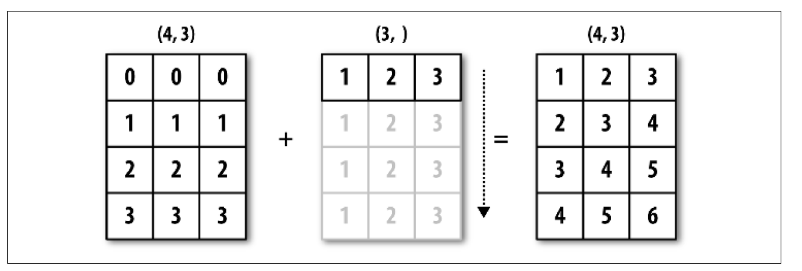

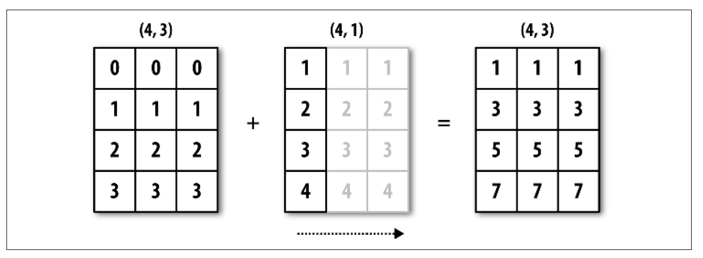

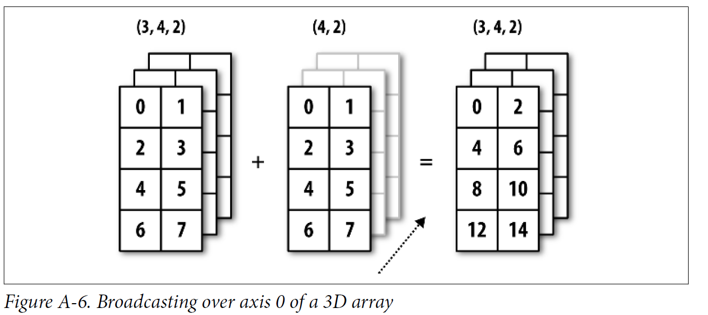

 for example here shape(3,4) can not broadcast we need shape(3,4,1) or (3,1,2)  or (3,1,1),or(1,1,1)(1,4,1)
(each trailing need match or 1)

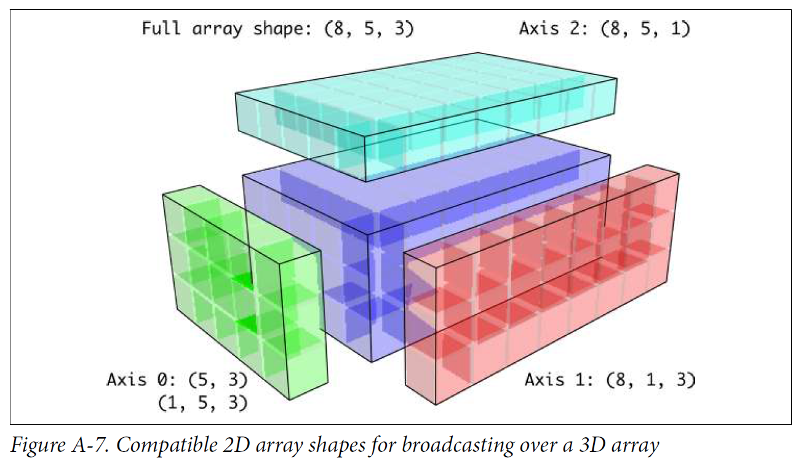

we can use **reshape** to handle (4) to (4,1,1) such like this 

however ,we can use anotherone 

the special **np.newaxis** attribute along with “full” slices to insert the new
axis

~~~~~~~~~

arr_1d = np.random.normal(size=3)

arr_1d[:, np.newaxis]
array([[-2.3594],
       [-0.1995],
       [-1.542 ]])
       
arr_1d[np.newaxis, :]
array([[-2.3594, -0.1995, -1.542 ]])

~~~~~~~~~

You might be wondering if there’s a way to generalize demeaning over an axis without
sacrificing performance. There is, but it requires some indexing gymnastics

~~~~

def demean_axis(arr, axis=0):

    means = arr.mean(axis)
    
    # This generalizes things like [:, :, np.newaxis] to N dimensions
    
    indexer = [slice(None)] * arr.ndim
    indexer[axis] = np.newaxis
    return arr - means[indexer]

~~~~
