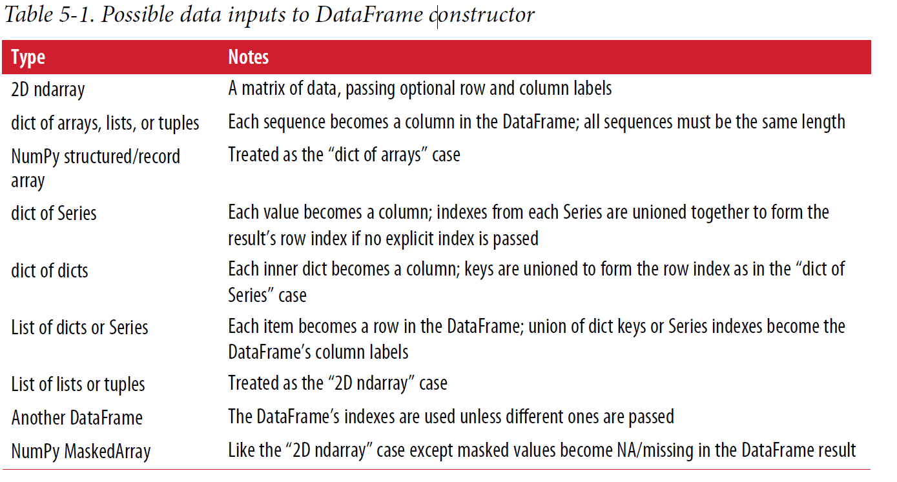
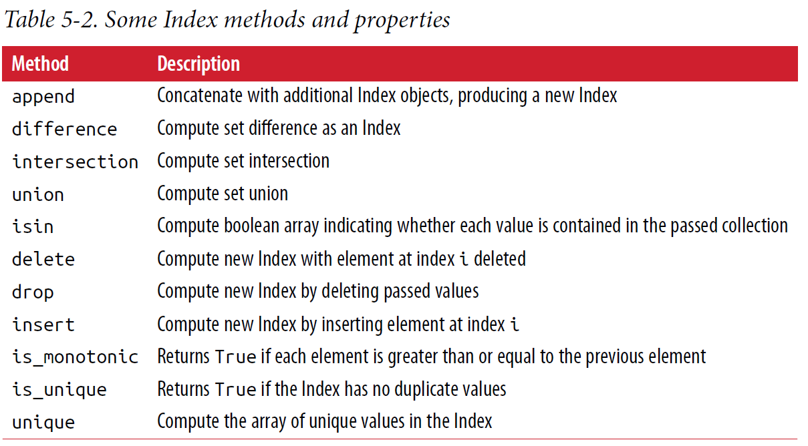
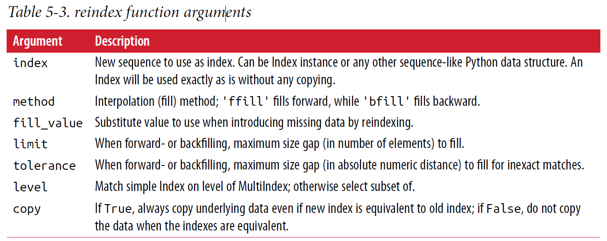
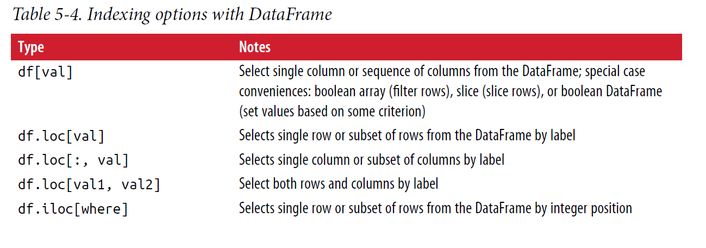
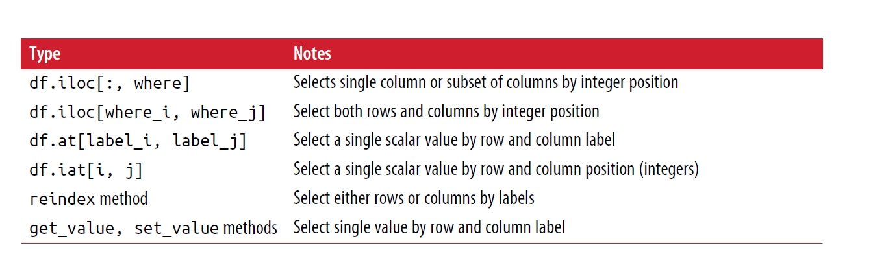
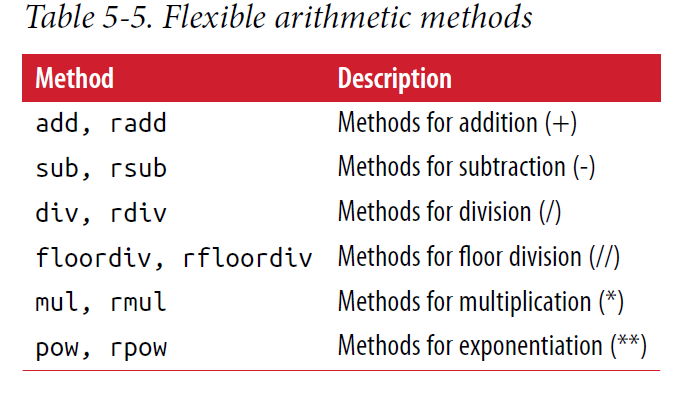
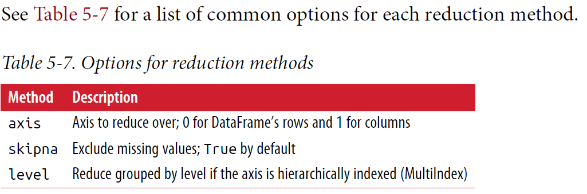
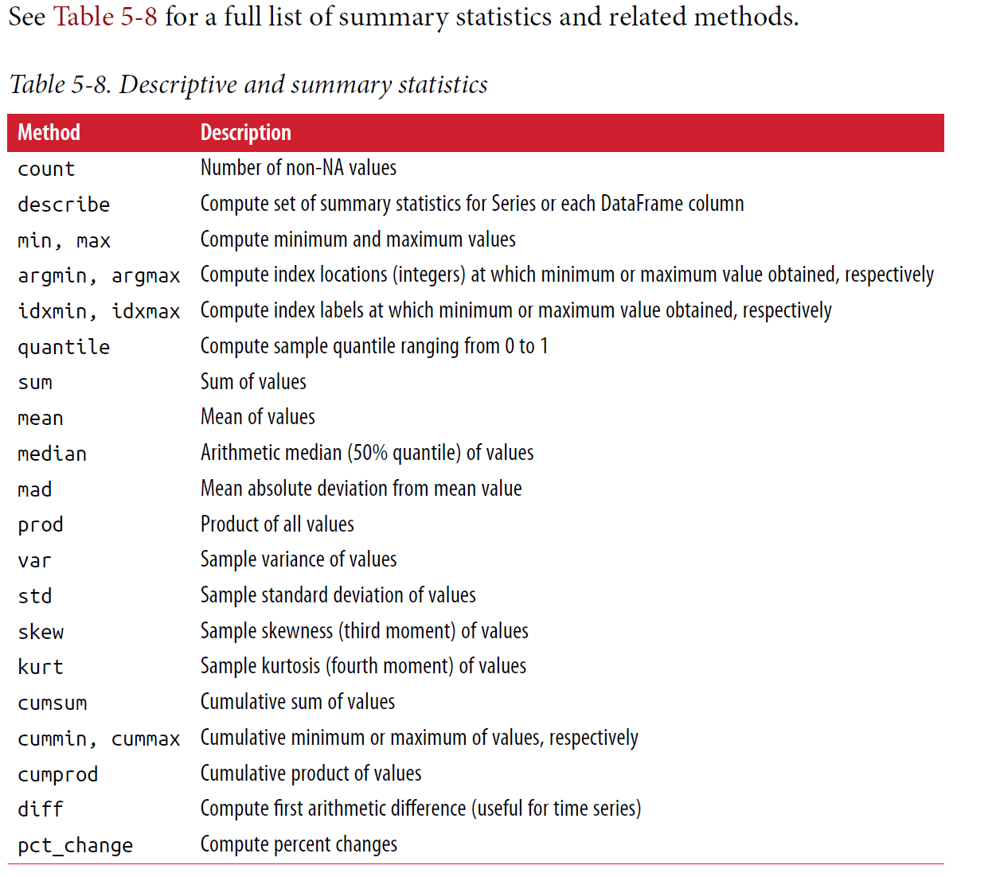

## Series
~~~~~~~~
  
  In [11]: obj = pd.Series([4, 7, -5, 3])
  In [12]: obj
  Out[12]:
  0 4
  1 7
  2 -5
  3 3
  dtype: int64
 

  In [13]: obj.values
  Out[13]: array([ 4, 7, -5, 3])
  In [14]: obj.index # like range(4)
  Out[14]: RangeIndex(start=0, stop=4, step=1)
  
  // The string representation of a Series displayed interactively shows the index on the
left and the values on the right. Since we did not specify an index for the data, a
default one consisting of the integers 0 through N - 1 (where N is the length of the
data) is created. //

  You can get the array representation and index object of the Series via
its values and index attributes, respectively
  
  In [15]: obj2 = pd.Series([4, 7, -5, 3], index=['d', 'b', 'a', 'c'])
  In [16]: obj2
  Out[16]:
  d 4
  b 7
  a -5
  c 3
  dtype: int64
  In [17]: obj2.index
  Out[17]: Index(['d', 'b', 'a', 'c'], dtype='object')
  
  Compared with NumPy arrays, you can use labels in the index when selecting single
values or a set of values:
 
  In [18]: obj2['a']
  Out[18]: -5
  In [19]: obj2['d'] = 6
  In [20]: obj2[['c', 'a', 'd']]
  Out[20]:
  c 3
  a -5
  d 6
  dtype: int64
  
  
  
In [21]: obj2[obj2 > 0]
Out[21]:
d 6
b 7
c 3
dtype: int64
In [22]: obj2 * 2
Out[22]:
d 12
b 14
a -10
c 6
dtype: int64
In [23]: np.exp(obj2)
Out[23]:
d 403.428793
b 1096.633158
a 0.006738
c 20.085537
dtype: float64

~~~~~~~~

--------------------------

~~~~~~~~
indexing like a dic
 
In [24]: 'b' in obj2   
Out[24]: True

In [25]: 'e' in obj2
Out[25]: False

In [26]: sdata = {'Ohio': 35000, 'Texas': 71000, 'Oregon': 16000, 'Utah': 5000}
In [27]: obj3 = pd.Series(sdata)
In [28]: obj3
Out[28]:
Ohio 35000
Oregon 16000
Texas 71000
Utah 5000
dtype: int64

  
~~~~~~~~

~~~~~
When you are only passing a dict, the index in the resulting Series will have the dict’s
keys in sorted order. You can override this by passing the dict keys in the order you
want them to appear in the resulting Series:

In [29]: states = ['California', 'Ohio', 'Oregon', 'Texas']
In [30]: obj4 = pd.Series(sdata, index=states)
In [31]: obj4
Out[31]:
California NaN
Ohio 35000.0
Oregon 16000.0
Texas 71000.0
dtype: float64

~~~~~

-------------------------

- Both the Series object itself and its index have a name attribute, which integrates with
other key areas of pandas functionality:
~~~~~

In [38]: obj4.name = 'population'
In [39]: obj4.index.name = 'state'
In [40]: obj4
Out[40]:
state
California NaN
Ohio 35000.0
Oregon 16000.0
Texas 71000.0
Name: population, dtype: float64

~~~~~

~~~~~

In [46]: frame.head()    // For large DataFrames, the head method selects only the first 5 rows:

Out[46]:
pop state year
0 1.5 Ohio 2000
1 1.7 Ohio 2001
2 3.6 Ohio 2002
3 2.4 Nevada 2001
4 2.9 Nevada 2002

In [47]: pd.DataFrame(data, columns=['year', 'state', 'pop']) //If you specify a sequence of columns, the DataFrame’s columns will be arranged in
that order:

Out[47]:
year state pop
0 2000 Ohio 1.5
1 2001 Ohio 1.7
2 2002 Ohio 3.6
3 2001 Nevada 2.4
4 2002 Nevada 2.9
5 2003 Nevada 3.2

If you pass a column that isn’t contained in the dict, it will appear with missing values
in the result:

In [48]: frame2 = pd.DataFrame(data, columns=['year', 'state', 'pop', 'debt'],
....: index=['one', 'two', 'three', 'four',
....: 'five', 'six'])

In [49]: frame2
Out[49]:
year state pop debt
one 2000 Ohio 1.5 NaN
two 2001 Ohio 1.7 NaN
three 2002 Ohio 3.6 NaN
four 2001 Nevada 2.4 NaN
five 2002 Nevada 2.9 NaN
six 2003 Nevada 3.2 NaN

~~~~~
## Frame
- 总结
- **frame.columns**  访问column index
- **frame.index**  访问row index

- frame['colunmn_name']  访问列 两种方法

  frame.colunmn_name

- frame.loc['row_name'] 访问行

~~~~~~
In [99]: frame
Out[99]:
Ohio Texas California
a 0 1 2
c 3 4 5
d 6 7 8

states = ['Texas', 'Utah', 'California']

In [104]: frame.loc[['a', 'b', 'c', 'd'], states]
Out[104]:
Texas Utah California
a 1.0 NaN 2.0
b NaN NaN NaN
c 4.0 NaN 5.0
d 7.0 NaN 8.0

~~~~~~

- **frame.values**  数据表格  value**s**

frame.index.name = 'year'; frame.columns.name = 'state'  行和列的名字

**Many functions, like drop, which modify the size or shape of a Series or DataFrame,
can manipulate an object in-place without returning a new object:**

**Be careful with the _inplace_, as it destroys any data that is dropped.**

-------------------------------------------
~~~~~
In [50]: frame2.columns
Out[50]: Index(['year', 'state', 'pop', 'debt'], dtype='object')

In [51]: frame2['state']
Out[51]:
one Ohio
two Ohio
three Ohio
four Nevada
five Nevada
six Nevada
Name: state, dtype: object

In [52]: frame2.year
Out[52]:
one 2000
two 2001
three 2002
four 2001
five 2002
six 2003
Name: year, dtype: int64

----------------------------------------------------------

In [53]: frame2.loc['three']
Out[53]:
year 2002
state Ohio
pop 3.6
debt NaN
Name: three, dtype: object

~~~~~

整列操作
- frame['clomun_name']= n                   all change to n

- frame['clomun_name']= np.arange(6.)       length must match 

- frame['clomun_name']= pd.Series           labels will be realigned exactly to the DataFrame’s index, inserting missing values in any holes
                                           

Assigning a column that doesn’t exist will create a new column.

*frame.clomun_name*(上面都是['clomun_name']) syntax can not use to create new column

del frame['clomun_name']           **del**      keyword will delete columns as with a dict.
~~~~~~~

frame2['debt'] = 16.5
In [55]: frame2
Out[55]:
year state pop debt
one 2000 Ohio 1.5 16.5
two 2001 Ohio 1.7 16.5
three 2002 Ohio 3.6 16.5
four 2001 Nevada 2.4 16.5
five 2002 Nevada 2.9 16.5
six 2003 Nevada 3.2 16.5

In [56]: frame2['debt'] = np.arange(6.)
In [57]: frame2
Out[57]:
year state pop debt
one 2000 Ohio 1.5 0.0
two 2001 Ohio 1.7 1.0
three 2002 Ohio 3.6 2.0
four 2001 Nevada 2.4 3.0
five 2002 Nevada 2.9 4.0
six 2003 Nevada 3.2 5.0

In [58]: val = pd.Series([-1.2, -1.5, -1.7], index=['two', 'four', 'five'])
In [59]: frame2['debt'] = val
In [60]: frame2
Out[60]:
year state pop debt
one 2000 Ohio 1.5 NaN
two 2001 Ohio 1.7 -1.2
three 2002 Ohio 3.6 NaN
four 2001 Nevada 2.4 -1.5
five 2002 Nevada 2.9 -1.7
six 2003 Nevada 3.2 NaN

~~~~~~~

---------------------------------------

~~~~~~~
In [65]: pop = {'Nevada': {2001: 2.4, 2002: 2.9},
....: 'Ohio': {2000: 1.5, 2001: 1.7, 2002: 3.6}}

If the nested dict is passed to the DataFrame, pandas will interpret the outer dict keys
as the columns and the inner keys as the row indices:

In [66]: frame3 = pd.DataFrame(pop)
In [67]: frame3
Out[67]:
Nevada Ohio
2000 NaN 1.5
2001 2.4 1.7
2002 2.9 3.6

The keys in the inner dicts are combined and sorted to form the index in the result.
This isn’t true if an explicit index is specified:

In [69]: pd.DataFrame(pop, index=[2001, 2002, 2003])  <--区别2003
Out[69]:
Nevada Ohio
2001 2.4 1.7
2002 2.9 3.6
2003 NaN NaN

~~~~~~~
__frame3.T__
~~~~~~~~~~

In [68]: frame3.T
Out[68]:
2000 2001 2002
Nevada NaN 2.4 2.9
Ohio 1.5 1.7 3.6

~~~~~~~~~~

- frame.index.name = 'year'; frame.columns.name = 'state'
~~~~~~~~

In [72]: frame3.index.name = 'year'; frame3.columns.name = 'state'
In [73]: frame3
Out[73]:
state Nevada Ohio
year
2000 NaN 1.5
2001 2.4 1.7
2002 2.9 3.6

~~~~~~~~

- frame.values

~~~~~~~
In [75]: frame2.values
Out[75]:
array([[2000, 'Ohio', 1.5, nan],
[2001, 'Ohio', 1.7, -1.2],
[2002, 'Ohio', 3.6, nan],
[2001, 'Nevada', 2.4, -1.5],
[2002, 'Nevada', 2.9, -1.7],
[2003, 'Nevada', 3.2, nan]], dtype=object)

~~~~~~~

complete list of things you can pass the DataFrame constructor

## Index Objects

pandas’s Index objects are responsible for holding the axis labels and other metadata
(like the axis name or names). Any array or other sequence of labels you use when
constructing a Series or DataFrame is internally converted to an Index:

~~~~~~
In [76]: obj = pd.Series(range(3), index=['a', 'b', 'c'])
In [77]: index = obj.index
In [78]: index
Out[78]: Index(['a', 'b', 'c'], dtype='object')
In [79]: index[1:]
Out[79]: Index(['b', 'c'], dtype='object')

Index objects are immutable and thus can’t be modified by the user:

index[1] = 'd' # TypeError

Immutability makes it safer to share Index objects among data structures:

In [80]: labels = pd.Index(np.arange(3))
In [81]: labels
Out[81]: Int64Index([0, 1, 2], dtype='int64')
In [82]: obj2 = pd.Series([1.5, -2.5, 0], index=labels)
In [83]: obj2
Out[83]:
0 1.5
1 -2.5
2 0.0
dtype: float64
In [84]: obj2.index is labels
Out[84]: True

~~~~~~

-----------------------

In addition to being array-like, an Index also behaves like a fixed-size set:

however

Unlike Python sets, a pandas Index can contain duplicate labels:
~~~~~~
In [86]: frame3.columns
Out[86]: Index(['Nevada', 'Ohio'], dtype='object', name='state')
In [87]: 'Ohio' in frame3.columns
Out[87]: True
In [88]: 2003 in frame3.index
Out[88]: False

Unlike Python sets, a pandas Index can contain duplicate labels:

In [89]: dup_labels = pd.Index(['foo', 'foo', 'bar', 'bar'])
In [90]: dup_labels
Out[90]: Index(['foo', 'foo', 'bar', 'bar'], dtype='object')

~~~~~~

Each Index has a number of methods and properties for set logic, which answer other
common questions about the data it contains. Some useful ones are summarized here

## Reindexing

~~~~~~~
In [91]: obj = pd.Series([4.5, 7.2, -5.3, 3.6], index=['d', 'b', 'a', 'c'])
In [92]: obj
Out[92]:
d 4.5
b 7.2
a -5.3
c 3.6
dtype: float64

Calling reindex on this Series rearranges the data according to the new index, introducing
missing values if any index values were not already present:

In [93]: obj2 = obj.reindex(['a', 'b', 'c', 'd', 'e'])
In [94]: obj2
Out[94]:
a -5.3
b 7.2
c 3.6
d 4.5
e NaN
dtype: float64

~~~~~~~

For ordered data like time series, it may be desirable to do some interpolation or filling
of values when reindexing. The method option allows us to do this, using a
method such as ffill, which forward-fills the values:

~~~~~~~
In [95]: obj3 = pd.Series(['blue', 'purple', 'yellow'], index=[0, 2, 4])
In [96]: obj3
Out[96]:
0 blue
2 purple
4 yellow
dtype: object

In [97]: obj3.reindex(range(6), method='ffill')
Out[97]:
0 blue
1 blue
2 purple
3 purple
4 yellow
5 yellow
dtype: object
~~~~~~~

- With DataFrame, reindex can alter either the (row) index, columns, or both. 
  -  When passed only a sequence, it reindexes the rows in the result:
     frame.reindex(indexobj)
  -  The columns can be reindexed with the columns keyword 
     frame.reindex(columns=indexobj)
~~~~~
In [98]: frame = pd.DataFrame(np.arange(9).reshape((3, 3)),
....: index=['a', 'c', 'd'],
....: columns=['Ohio', 'Texas', 'California'])
In [99]: frame
Out[99]:
Ohio Texas California
a 0 1 2
c 3 4 5
d 6 7 8
----------------------------------------------------------------------index
In [100]: frame2 = frame.reindex(['a', 'b', 'c', 'd'])
In [101]: frame2
Out[101]:
Ohio Texas California
a 0.0 1.0 2.0
b NaN NaN NaN
c 3.0 4.0 5.0
d 6.0 7.0 8.0

----------------------------------------------------------------------column
In [102]: states = ['Texas', 'Utah', 'California']
In [103]: frame.reindex(columns=states)
Out[103]:
Texas Utah California
a 1 NaN 2
c 4 NaN 5
d 7 NaN 8

~~~~~

you can reindex more succinctly by label-indexing with loc, and many users prefer to use it exclusively

~~~~~~~~~
frame.loc[['a', 'b', 'c', 'd'], states]   #总结地方有
~~~~~~~~~

reindex function arguments

## Dropping Entries from an Axis

~~~~~
Calling drop with a sequence of labels will drop values from the row labels (axis 0):
- data.drop(['Colorado', 'Ohio'])

You can drop values from the columns by passing axis=1 or axis='columns':
- data.drop('two', axis=1)

In [105]: obj = pd.Series(np.arange(5.), index=['a', 'b', 'c', 'd', 'e'])
In [106]: obj
Out[106]:
a 0.0
b 1.0
c 2.0
d 3.0
e 4.0
dtype: float64

In [107]: new_obj = obj.drop('c')
In [108]: new_obj
Out[108]:
a 0.0
b 1.0
d 3.0
e 4.0
dtype: float64

In [109]: obj.drop(['d', 'c'])
Out[109]:
a 0.0
b 1.0
e 4.0
dtype: float64

data.drop('two', axis=1)  # drop columns 
~~~~~

## Indexing, Selection, and Filtering

**Series** indexing (obj[...]) works analogously to NumPy array indexing, except you
can use the Series’s index values instead of only integers. Here are some examples of
this:

**类似NumPy array indexing   ([:] slice , obj[obj < 2] boolean 等等) **

~~~~~~~~~~
In [117]: obj = pd.Series(np.arange(4.), index=['a', 'b', 'c', 'd'])
In [118]: obj
Out[118]:
a 0.0
b 1.0
c 2.0
d 3.0
dtype: float64

In [119]: obj['b']
Out[119]: 1.0

In [120]: obj[1]
Out[120]: 1.0
In [121]: obj[2:4]
Out[121]:
c 2.0
d 3.0
dtype: float64
In [122]: obj[['b', 'a', 'd']]
Out[122]:
b 1.0
a 0.0
d 3.0
dtype: float64
In [123]: obj[[1, 3]]
Out[123]:
b 1.0
d 3.0
dtype: float64
In [124]: obj[obj < 2]
Out[124]:
a 0.0
b 1.0
dtype: float64

~~~~~~~~~~

---------------------------

Indexing into a **DataFrame** is for retrieving one or more **columns** either with a single
value or sequence:

~~~~~~~~
In [128]: data = pd.DataFrame(np.arange(16).reshape((4, 4)),
.....: index=['Ohio', 'Colorado', 'Utah', 'New York'],
.....: columns=['one', 'two', 'three', 'four'])
In [129]: data
Out[129]:
one two three four
Ohio 0 1 2 3
Colorado 4 5 6 7
Utah 8 9 10 11
New York 12 13 14 15
In [130]: data['two']
Out[130]:
Ohio 1
Colorado 5
Utah 9
New York 13
Name: two, dtype: int64
In [131]: data[['three', 'one']]
Out[131]:
three one
Ohio 2 0
Colorado 6 4
Utah 10 8
New York 14 12

~~~~~~~~

Indexing like this has a few special cases. First, slicing or selecting data with a boolean
array:

~~~~~~~~

The row selection syntax data[:2] is provided as a convenience. Passing a single element
or a list to the [] operator selects columns.

In [132]: data[:2]             
Out[132]:
one two three four
Ohio 0 1 2 3
Colorado 4 5 6 7

Another use case is in indexing with a boolean DataFrame, such as one produced by a
scalar comparison:

In [133]: data[data['three'] > 5]
Out[133]:
one two three four
Colorado 4 5 6 7
Utah 8 9 10 11
New York 12 13 14 15

--------------------------

In [134]: data < 5
Out[134]:
one two three four
Ohio True True True True
Colorado True False False False
Utah False False False False
New York False False False False

In [135]: data[data < 5] = 0
In [136]: data
Out[136]:
one two three four
Ohio 0 0 0 0
Colorado 0 5 6 7
Utah 8 9 10 11
New York 12 13 14 15

This makes DataFrame syntactically more like a two-dimensional NumPy array in
this particular case.
~~~~~~~~

### Selection with loc and iloc

loc and iloc. They enable you to select a subset of the rows and columns from a
DataFrame with NumPy-like notation using either axis labels (loc) or integers
(iloc).

~~~~~~~~~~~~~

In [136]: data
Out[136]:
one two three four
Ohio 0 0 0 0
Colorado 0 5 6 7
Utah 8 9 10 11
New York 12 13 14 15

In [137]: data.loc['Colorado', ['two', 'three']]
Out[137]:
two 5
three 6
Name: Colorado, dtype: int64

In [138]: data.iloc[2, [3, 0, 1]]
Out[138]:
four 11
one 8
two 9
Name: Utah, dtype: int64

In [139]: data.iloc[2]
Out[139]:
one 8
two 9
three 10
four 11
Name: Utah, dtype: int64

In [140]: data.iloc[[1, 2], [3, 0, 1]]
Out[140]:
four one two
Colorado 7 0 5
Utah 11 8 9

Both indexing functions work with slices in addition to single labels or lists of labels:

In [141]: data.loc[:'Utah', 'two']
Out[141]:
Ohio 0
Colorado 5
Utah 9
Name: two, dtype: int64

In [142]: data.iloc[:, :3][data.three > 5]
Out[142]:
one two three
Colorado 0 5 6
Utah 8 9 10
New York 12 13 14

~~~~~~~~~~~~~

### Integer Indexes

Working with pandas objects indexed by integers is something that often trips up
new users due to some differences with indexing semantics on built-in Python data
structures like lists and tuples. For example, you might not expect the following code
to generate an error:

~~~~~~~~~

ser = pd.Series(np.arange(3.))
ser
ser[-1]

On the other hand, with a non-integer index, there is no potential for ambiguity:

In [145]: ser2 = pd.Series(np.arange(3.), index=['a', 'b', 'c'])
In [146]: ser2[-1]
Out[146]: 2.0

To keep things consistent, if you have an axis index containing integers, data selection
will always be label-oriented. For more precise handling, use loc (for labels) or iloc
(for integers):
------------------------------------
In [147]: ser[:1]

Out[147]:
0 0.0
dtype: float64
------------------------------------
In [148]: ser.loc[:1]

Out[148]:
0 0.0
1 1.0
dtype: float64
------------------------------------
In [149]: ser.iloc[:1]

Out[149]:
0 0.0
dtype: float64

~~~~~~~~~

### Arithmetic and Data Alignment

~~~~~~~

In [150]: s1 = pd.Series([7.3, -2.5, 3.4, 1.5], index=['a', 'c', 'd', 'e'])

In [151]: s2 = pd.Series([-2.1, 3.6, -1.5, 4, 3.1],
.....: index=['a', 'c', 'e', 'f', 'g'])

In [152]: s1
Out[152]:
a 7.3
c -2.5
d 3.4
e 1.5
dtype: float64

In [153]: s2
Out[153]:
a -2.1
c 3.6
e -1.5
f 4.0
g 3.1
dtype: float64

Adding these together yields:

In [154]: s1 + s2
Out[154]:
a 5.2
c 1.1
d NaN
e 0.0
f NaN
g NaN
dtype: float64

The internal data alignment introduces missing values in the label locations that don’t
overlap. Missing values will then propagate in further arithmetic computations.

In the case of DataFrame alignment is performed on both the rows and the columns

In [155]: df1 = pd.DataFrame(np.arange(9.).reshape((3, 3)), columns=list('bcd'),
.....: index=['Ohio', 'Texas', 'Colorado'])
In [156]: df2 = pd.DataFrame(np.arange(12.).reshape((4, 3)), columns=list('bde'),
.....: index=['Utah', 'Ohio', 'Texas', 'Oregon'])

In [157]: df1
Out[157]:
            b    c    d
Ohio        0.0 1.0 2.0
Texas       3.0 4.0 5.0
Colorado    6.0 7.0 8.0

In [158]: df2
Out[158]:
           b   d     e
Utah     0.0  1.0   2.0
Ohio     3.0  4.0   5.0
Texas    6.0  7.0   8.0
Oregon   9.0  10.0  11.0

Adding these together returns a DataFrame whose index and columns are the unions
of the ones in each DataFrame:

In [159]: df1 + df2
Out[159]:
          b   c   d   e
Colorado NaN NaN NaN NaN
Ohio     3.0 NaN 6.0 NaN
Oregon   NaN NaN NaN NaN
Texas    9.0 NaN 12.0 NaN
Utah     NaN NaN NaN NaN

Since the 'c' and 'e' columns are not found in both DataFrame objects, they appear
as all missing in the result. The same holds for the rows whose labels are not common
to both objects.

If you add DataFrame objects with no column or row labels in common, the result
will contain all nulls:

Out[162]:
A
0 1
1 2

Out[163]:
B
0 3
1 4

In [164]: df1 - df2
Out[164]:
A B
0 NaN NaN
1 NaN NaN

             Arithmetic methods with ill values
             
In [168]: df1
Out[168]:
a b c d
0 0.0 1.0 2.0 3.0
1 4.0 5.0 6.0 7.0
2 8.0 9.0 10.0 11.0

In [169]: df2
Out[169]:
a b c d e
0 0.0 1.0 2.0 3.0 4.0
1 5.0 NaN 7.0 8.0 9.0
2 10.0 11.0 12.0 13.0 14.0
3 15.0 16.0 17.0 18.0 19.0            

In [171]: df1.add(df2, fill_value=0)
Out[171]:
   a    b    c     d    e
0  0.0  2.0  4.0   6.0  4.0
1  9.0  5.0  13.0 15.0  9.0
2  18.0 20.0 22.0 24.0 14.0
3  15.0 16.0 17.0 18.0 19.0

~~~~~~~

#### Flexible arithmetic methods

listing of Series and DataFrame methods for arithmetic. Each of
them has a counterpart, starting with the letter r, that has arguments flipped.

this give all ways(cause have flipped) to use arithmetic with fill_value

#### Operations between DataFrame and Series

similar to the broadcast in Numpy

~~~~~~~~~~

In [179]: frame = pd.DataFrame(np.arange(12.).reshape((4, 3)),
.....: columns=list('bde'),
.....: index=['Utah', 'Ohio', 'Texas', 'Oregon'])
In [180]: series = frame.iloc[0]

In [181]: frame
Out[181]:
       b   d   e
Utah 0.0 1.0 2.0
Ohio 3.0 4.0 5.0
Texas 6.0 7.0 8.0
Oregon 9.0 10.0 11.0

In [182]: series
Out[182]:
b 0.0
d 1.0
e 2.0
Name: Utah, dtype: float64

In [183]: frame - series
Out[183]:
       b  d    e
Utah 0.0 0.0 0.0
Ohio 3.0 3.0 3.0
Texas 6.0 6.0 6.0
Oregon 9.0 9.0 9.0

If an index value is not found in either the DataFrame’s columns or the Series’s index,
the objects will be reindexed to form the union:

If you want to instead broadcast over the columns, matching on the rows, you have to
use one of the arithmetic methods. For example:

In [186]: series3 = frame['d']
In [187]: frame
Out[187]:
       b  d   e
Utah 0.0 1.0 2.0
Ohio 3.0 4.0 5.0
Texas 6.0 7.0 8.0
Oregon 9.0 10.0 11.0

In [188]: series3
Out[188]:
Utah 1.0
Ohio 4.0
Texas 7.0
Oregon 10.0
Name: d, dtype: float64

In [189]: frame.sub(series3, axis='index')   # or axis=0
Out[189]:
b d e
Utah -1.0 0.0 1.0
Ohio -1.0 0.0 1.0
Texas -1.0 0.0 1.0
Oregon -1.0 0.0 1.0

~~~~~~~~~~

## Function Application and Mapping

NumPy ufuncs (element-wise array methods) also work with pandas objects:

~~~~~~
In [191]: frame
Out[191]:
          b d e
Utah -0.204708 0.478943 -0.519439
Ohio -0.555730 1.965781 1.393406
Texas 0.092908 0.281746 0.769023
Oregon 1.246435 1.007189 -1.296221

In [192]: np.abs(frame)
Out[192]:
         b d e
Utah 0.204708 0.478943 0.519439
Ohio 0.555730 1.965781 1.393406
Texas 0.092908 0.281746 0.769023
Oregon 1.246435 1.007189 1.296221

~~~~~~

----------------------------------------------------

Another frequent operation is applying a function on one-dimensional arrays to each
column or row. DataFrame’s apply method does exactly this:

~~~~~~

In [193]: f = lambda x: x.max() - x.min()

In [194]: frame.apply(f)
Out[194]:
b 1.802165
d 1.684034
e 2.689627
dtype: float64

In [195]: frame.apply(f, axis='columns')
Out[195]:
Utah 0.998382
Ohio 2.521511
Texas 0.676115
Oregon 2.542656
dtype: float64

~~~~~~

The function passed to apply need not return a scalar value; it can also return a Series
with multiple values:

~~~~~
In [196]: def f(x):
.....: return pd.Series([x.min(), x.max()], index=['min', 'max'])

In [197]: frame.apply(f)
Out[197]:
b d e
min -0.555730 0.281746 -1.296221
max 1.246435 1.965781 1.393406

~~~~~

Element-wise Python functions can be used, too. Suppose you wanted to compute a
formatted string from each floating-point value in frame. You can do this with applymap:

applymap: Element-wise Python functions for Dataframe
map: Element-wise Python functions for Serise

~~~~~~~
In [198]: format = lambda x: '%.2f' % x
In [199]: frame.applymap(format)
Out[199]:
b d e
Utah -0.20 0.48 -0.52
Ohio -0.56 1.97 1.39
Texas 0.09 0.28 0.77
Oregon 1.25 1.01 -1.30

The reason for the name applymap is that Series has a map method for applying an
element-wise function:

In [200]: frame['e'].map(format)
Out[200]:
Utah -0.52
Ohio 1.39
Texas 0.77
Oregon -1.30
Name: e, dtype: object

~~~~~~~

## Sorting and Ranking

obj.sort_index(axis=0, ascending=True)

~~~~~~~~~~

In [201]: obj = pd.Series(range(4), index=['d', 'a', 'b', 'c'])
In [202]: obj.sort_index()
Out[202]:
a 1
b 2
c 3
d 0
dtype: int64

In [203]: frame = pd.DataFrame(np.arange(8).reshape((2, 4)),
.....: index=['three', 'one'],
.....: columns=['d', 'a', 'b', 'c'])

In [204]: frame.sort_index()
Out[204]:
      d a b c
one   4 5 6 7
three 0 1 2 3

In [205]: frame.sort_index(axis=1)
Out[205]:
       a b c d
three  1 2 3 0
one    5 6 7 4

In [206]: frame.sort_index(axis=1, ascending=False)
Out[206]:
d c b a
three 0 3 2 1
one 4 7 6 5

~~~~~~~~~~

obj.sort_values()
sort_values(by='b')
sort_values(by=['a', 'b'])
~~~~~~~

Any missing values are sorted to the end of the Series by default:

In [209]: obj = pd.Series([4, np.nan, 7, np.nan, -3, 2])

In [210]: obj.sort_values()
Out[210]:
4 -3.0
5 2.0
0 4.0
2 7.0
1 NaN
3 NaN
dtype: float64

In [212]: frame
Out[212]:
  a b
0 0 4
1 1 7
2 0 -3
3 1 2

In [213]: frame.sort_values(by='b')
Out[213]:
  a b
2 0 -3
3 1 2
0 0 4
1 1 7

To sort by multiple columns, pass a list of names:

In [214]: frame.sort_values(by=['a', 'b'])
Out[214]:
a b
2 0 -3
0 0 4
3 1 2
1 1 7

~~~~~~~

### Axis Indexes with Duplicate Labels

~~~~~~~~
In [222]: obj = pd.Series(range(5), index=['a', 'a', 'b', 'b', 'c'])
In [223]: obj
Out[223]:
a 0
a 1
b 2
b 3
c 4
dtype: int64
The index’s is_unique property can tell you whether its labels are unique or not:
In [224]: obj.index.is_unique
Out[224]: False

Data selection is one of the main things that behaves differently with duplicates.
Indexing a label with multiple entries returns a Series, while single entries return a
scalar value:

In [225]: obj['a']
Out[225]:
a 0
a 1
dtype: int64

In [226]: obj['c']
Out[226]: 4
~~~~~~~~

###  Summarizing and Computing Descriptive Statistics 

~~~~~~~~~~~
In [231]: df
Out[231]:
one two
a 1.40 NaN
b 7.10 -4.5
c NaN NaN
d 0.75 -1.3

Calling DataFrame’s sum method returns a Series containing column sums:

In [232]: df.sum()
Out[232]:
one 9.25
two -5.80
dtype: float64
Passing axis='columns' or axis=1 sums across the columns instead:

In [233]: df.sum(axis='columns')
Out[233]:
a 1.40
b 2.60
c NaN
d -0.55
dtype: float64

NA values are excluded unless the entire slice (row or column in this case) is NA.
This can be disabled with the skipna option:

In [234]: df.mean(axis='columns', skipna=False)
Out[234]:
a NaN
b 1.300
c NaN
d -0.275
dtype: float64

~~~~~~~~~~~

Some methods, like idxmin and idxmax, return indirect statistics like the index value
where the minimum or maximum values are attained:

idxmin()   idx m~~~     有个x
idxmax()

accumulations
df.cumsum()

describe()
~~~~~~~
In [237]: df.describe()
Out[237]:
         one     two
count 3.000000 2.000000
mean 3.083333 -2.900000
std 3.493685 2.262742
min 0.750000 -4.500000
25% 1.075000 -3.700000
50% 1.400000 -2.900000
75% 4.250000 -2.100000
max 7.100000 -1.300000

On non-numeric data, describe produces alternative summary statistics:

In [238]: obj = pd.Series(['a', 'a', 'b', 'c'] * 4)
In [239]: obj.describe()
Out[239]:
count 16
unique 3
top a
freq 8
dtype: object

~~~~~~~

